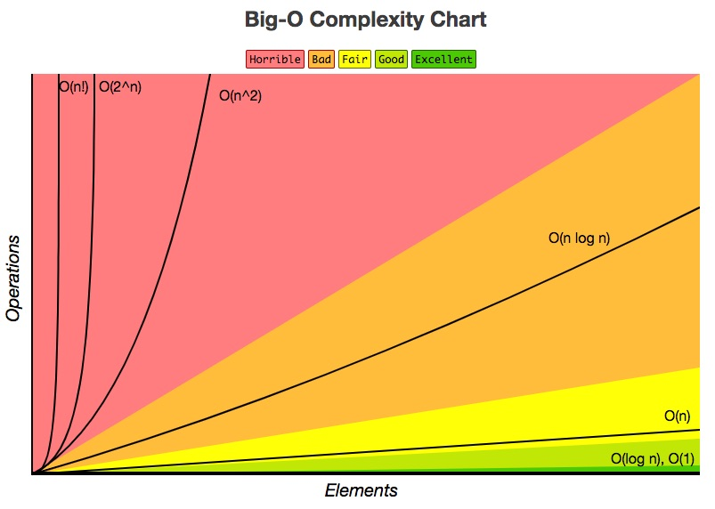
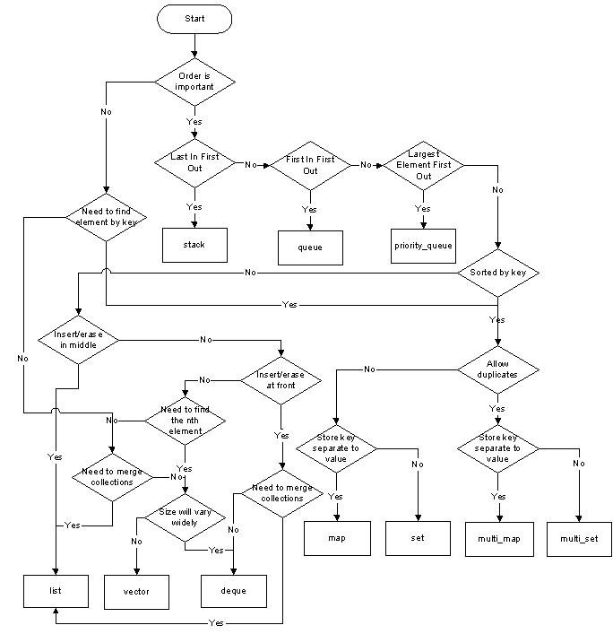
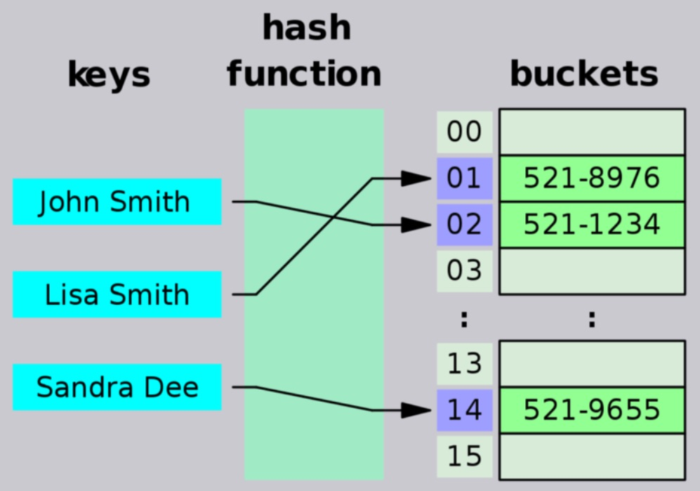
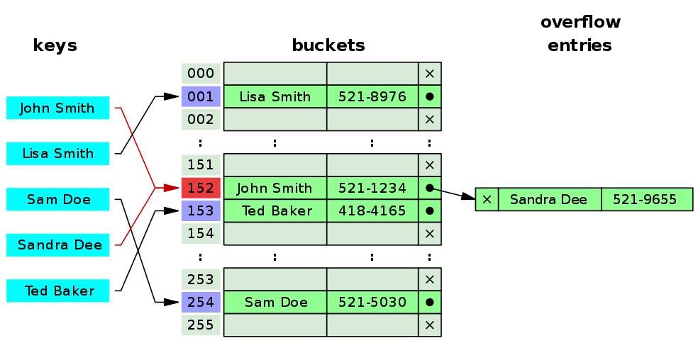
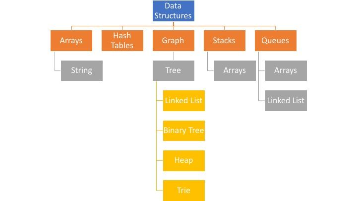
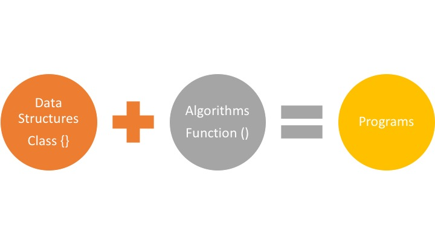
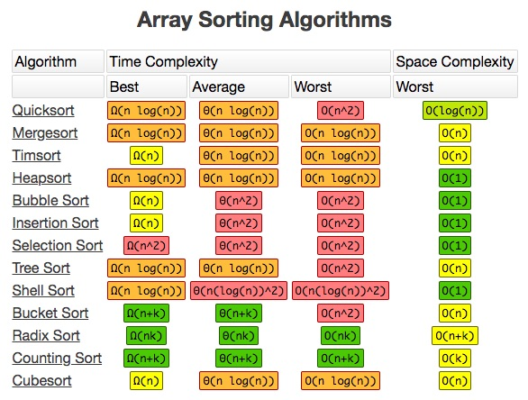

# Master the Coding Interview: Data Structures + Algorithms

## Table of contents

- [Master the Coding Interview: Data Structures + Algorithms](#master-the-coding-interview-data-structures--algorithms)
  - [Table of contents](#table-of-contents)
  - [**Section 1: Introduction**](#section-1-introduction)
  - [**Section 2: Getting More Interviews**](#section-2-getting-more-interviews)
    - [Resume](#resume)
    - [What If I Don't Have Enough Experience?](#what-if-i-dont-have-enough-experience)
    - [Portfolio](#portfolio)
    - [Where To Find Jobs?](#where-to-find-jobs)
  - [**Section 3: Big O**](#section-3-big-o)
    - [Setting Up Your Environment](#setting-up-your-environment)
    - [What Is Good Code?](#what-is-good-code)
    - [O(n)](#on)
    - [O(1)](#o1)
    - [Exercise: Big O Calculation](#exercise-big-o-calculation)
    - [Exercise: Big O Calculation 2](#exercise-big-o-calculation-2)
    - [Simplifying Big O](#simplifying-big-o)
    - [Big O Rule 1 - Worst Case](#big-o-rule-1---worst-case)
    - [Big O Rule 2 - Remove Constants](#big-o-rule-2---remove-constants)
    - [Big O Rule 3 - Different terms for inputs](#big-o-rule-3---different-terms-for-inputs)
    - [O(n^2)](#on2)
    - [Big O Rule 4 - Drop Non Dominants](#big-o-rule-4---drop-non-dominants)
    - [What Does This All Mean?](#what-does-this-all-mean)
    - [O(n!)](#on-1)
    - [3 Pillars Of Programming](#3-pillars-of-programming)
    - [Space Complexity](#space-complexity)
    - [Exercise: Space Complexity](#exercise-space-complexity)
  - [**Section 4: How To Solve Coding Problems**](#section-4-how-to-solve-coding-problems)
    - [What Are Companies Looking For?](#what-are-companies-looking-for)
    - [What We Need For Coding Interviews](#what-we-need-for-coding-interviews)
    - [Exercise: Interview Question](#exercise-interview-question)
    - [Review Google Interview](#review-google-interview)
  - [**Section 5: Data Structures: Introduction**](#section-5-data-structures-introduction)
    - [How to choose the right Data Structure?](#how-to-choose-the-right-data-structure)
    - [Examples of Data Structures in real life](#examples-of-data-structures-in-real-life)
    - [What Is A Data Structure?](#what-is-a-data-structure)
    - [How Computers Store Data](#how-computers-store-data)
    - [Data Structures In Different Languages](#data-structures-in-different-languages)
    - [Operations On Data Structures](#operations-on-data-structures)
  - [**Section 6: Data Structures: Arrays**](#section-6-data-structures-arrays)
    - [Arrays Introduction](#arrays-introduction)
    - [Static vs Dynamic Arrays](#static-vs-dynamic-arrays)
    - [Optional: Classes In Javascript](#optional-classes-in-javascript)
    - [Implementing An Array](#implementing-an-array)
    - [Exercise: Reverse A String](#exercise-reverse-a-string)
    - [Exercise: Merge Sorted Arrays](#exercise-merge-sorted-arrays)
    - [Interview Questions: Arrays](#interview-questions-arrays)
  - [**Section 7: Data Structures: Hash Tables**](#section-7-data-structures-hash-tables)
    - [Hash Tables Introduction](#hash-tables-introduction)
    - [Hash Function](#hash-function)
    - [Hash Collisions](#hash-collisions)
    - [Exercise: Implement A Hash Table](#exercise-implement-a-hash-table)
    - [Hash Tables VS Arrays](#hash-tables-vs-arrays)
    - [Exercise: First Recurring Character](#exercise-first-recurring-character)
    - [Hash Tables Review](#hash-tables-review)
  - [**Section 8: Data Structures: Linked Lists**](#section-8-data-structures-linked-lists)
    - [Linked Lists Introduction](#linked-lists-introduction)
    - [What Is A Linked List?](#what-is-a-linked-list)
    - [Exercise: Why Linked Lists?](#exercise-why-linked-lists)
    - [Doubly Linked Lists](#doubly-linked-lists)
    - [Linked Lists Review](#linked-lists-review)
  - [**Section 9: Data Structures: Stacks + Queues**](#section-9-data-structures-stacks--queues)
    - [Stacks + Queues Introduction](#stacks--queues-introduction)
    - [Stacks](#stacks)
    - [Queues](#queues)
    - [Stacks VS Queues](#stacks-vs-queues)
    - [Exercise: Stack Implementation (Linked Lists)](#exercise-stack-implementation-linked-lists)
    - [Exercise: Stack Implementation (Array)](#exercise-stack-implementation-array)
    - [Exercise: Queue Implementation (Linked Lists)](#exercise-queue-implementation-linked-lists)
    - [Exercise: Queue Implementation (Array)](#exercise-queue-implementation-array)
    - [Queues Using Stacks](#queues-using-stacks)
    - [Stacks + Queues Review](#stacks--queues-review)
  - [**Section 10: Data Structures: Trees**](#section-10-data-structures-trees)
    - [Trees Introduction](#trees-introduction)
    - [Binary Trees](#binary-trees)
    - [Balanced VS Unbalanced BST](#balanced-vs-unbalanced-bst)
    - [BST Pros and Cons](#bst-pros-and-cons)
    - [Exercise: Binary Search Tree](#exercise-binary-search-tree)
    - [AVL Trees vs Red Black Trees](#avl-trees-vs-red-black-trees)
    - [Binary Heaps](#binary-heaps)
    - [Trie](#trie)
  - [**Section 11: Data Structures: Graphs**](#section-11-data-structures-graphs)
    - [Types Of Graphs](#types-of-graphs)
    - [Exercise: Graph Implementation](#exercise-graph-implementation)
    - [Graphs Review](#graphs-review)
    - [Data Structures Review](#data-structures-review)
  - [**Section 12: Algorithms: Recursion**](#section-12-algorithms-recursion)
    - [Introduction to Algorithms](#introduction-to-algorithms)
    - [Stack Overflow](#stack-overflow)
    - [Anatomy Of Recursion](#anatomy-of-recursion)
    - [Exercise: Factorial](#exercise-factorial)
    - [Exercise: Fibonacci](#exercise-fibonacci)
    - [Recursive VS Iterative](#recursive-vs-iterative)
    - [When To Use Recursion](#when-to-use-recursion)
    - [Exercise: Reverse String With Recursion](#exercise-reverse-string-with-recursion)
    - [Recursion Review](#recursion-review)
  - [**Section 13: Algorithms: Sorting**](#section-13-algorithms-sorting)
    - [Sorting Introduction](#sorting-introduction)
    - [The Issue With sort()](#the-issue-with-sort)
    - [Sorting Algorithms](#sorting-algorithms)
    - [Exercise: Bubble Sort](#exercise-bubble-sort)
    - [Exercise: Selection Sort](#exercise-selection-sort)
    - [Dancing Algorithms](#dancing-algorithms)
    - [Insertion Sort](#insertion-sort)
    - [O(n log n)](#on-log-n)
    - [Exercise: Merge Sort](#exercise-merge-sort)
    - [Quick Sort](#quick-sort)
    - [Which Sort Is Best?](#which-sort-is-best)
    - [Heap Sort](#heap-sort)
    - [Radix Sort + Counting Sort](#radix-sort--counting-sort)
    - [Sorting Interview](#sorting-interview)
  - [**Section 14: Algorithms: Searching + BFS + DFS**](#section-14-algorithms-searching--bfs--dfs)
    - [Searching + Traversal Introduction](#searching--traversal-introduction)
    - [Linear Search](#linear-search)
    - [Binary Search](#binary-search)
    - [BFS vs DFS](#bfs-vs-dfs)
    - [breadthFirstSearch()](#breadthfirstsearch)
    - [PreOrder, InOrder, PostOrder](#preorder-inorder-postorder)
    - [depthFirstSearch()](#depthfirstsearch)
    - [Exercise: Validate A BST](#exercise-validate-a-bst)
    - [Graph Traversals](#graph-traversals)
    - [Dijkstra + Bellman-Ford Algorithms](#dijkstra--bellman-ford-algorithms)
  - [**Section 15: Algorithms: Dynamic Programming**](#section-15-algorithms-dynamic-programming)
    - [Dynamic Programming Introduction](#dynamic-programming-introduction)
    - [Memoization](#memoization)
    - [Memoization](#memoization-1)
    - [Fibonacci and Dynamic Programming](#fibonacci-and-dynamic-programming)
    - [Interview Questions: Dynamic Programming](#interview-questions-dynamic-programming)
  - [**Section 16: Non Technical Interviews**](#section-16-non-technical-interviews)
    - [Section Overview](#section-overview)
    - [During The Interview](#during-the-interview)
    - [Tell Me About Yourself (1 min)](#tell-me-about-yourself-1-min)
    - [Why Us?](#why-us)
    - [Tell Me About A Problem You Have Solved](#tell-me-about-a-problem-you-have-solved)
    - [What Is Your Biggest Weakness](#what-is-your-biggest-weakness)
    - [Any Questions For Us?](#any-questions-for-us)
    - [Secret Weapon](#secret-weapon)
    - [After The Interview](#after-the-interview)
    - [Section Summary](#section-summary)
  - [**Section 17: Offer + Negotiation**](#section-17-offer--negotiation)
    - [Negotiation 101](#negotiation-101)
    - [Handling An Offer](#handling-an-offer)
    - [Handling Multiple Offers](#handling-multiple-offers)
    - [Getting A Raise](#getting-a-raise)
    - [Negotiation Master](#negotiation-master)
  - [**Section 19: Extras: Google, Amazon, Facebook Interview Questions**](#section-19-extras-google-amazon-facebook-interview-questions)

## **Section 1: Introduction**

[Interview Mind Map](https://coggle.it/diagram/W5u8QkZs6r4sZM3J/t/master-the-interview)

- Getting the Interview
- Big O Notation
- Technical Interviews
- Non Technical Interviews
- Offer + Negotiation

[Technical Interview Mind Map](https://coggle.it/diagram/W5E5tqYlrXvFJPsq/t/master-the-interview-click-here-for-course-link)

- Data Structures
- Algorithms

Fast Track

- Getting The Interview
- Non Technical Interview
- Offer + Negotiation

Complete

- Everything

Tech Track

- Big O
- How To Solve Problems
- Data Structures
- Algorithms
- Extra Coding Exercises

**[⬆ back to top](#table-of-contents)**

## **Section 2: Getting More Interviews**

- Resume
- LinkedIn
- Portfolio
- Email

**[⬆ back to top](#table-of-contents)**

### Resume

Resources

- [ResumeMaker.Online](https://www.resumemaker.online/)
- [Resume Cheat Sheet](https://github.com/aneagoie/resume-checklist)
- [Jobscan](https://www.jobscan.co/)
- [Engineering Resume Templates](https://www.cakeresume.com/Engineering-resume-samples)
- [This resume does not exist](https://thisresumedoesnotexist.com/)

Resume

- One Page
- Relevant Skills
- Personalized
- Online Link

**[⬆ back to top](#table-of-contents)**

### What If I Don't Have Enough Experience?

[Creative Tim](https://www.creative-tim.com/)
[Free HTML templates](http://www.mashup-template.com/)
[Medium](https://medium.com/)

- GitHub
- Website
- 1 - 2 Big Projects
- Blog

**[⬆ back to top](#table-of-contents)**

### Portfolio

- [Creative Tim](https://www.creative-tim.com/)
- [HTML5/CSS3 Free Templates](http://www.mashup-template.com/templates.html)
- [ZtM-Job-Board](https://github.com/zero-to-mastery/ZtM-Job-Board)
- [Landing page templates for startups](https://cruip.com/)
- [Free Bootstrap Templates & Themes](https://mdbootstrap.com/freebies/)
- [15 Web Developer Portfolios to Inspire You](https://www.freecodecamp.org/news/15-web-developer-portfolios-to-inspire-you-137fb1743cae/)

**[⬆ back to top](#table-of-contents)**

### Where To Find Jobs?

[Where To Find Jobs?](https://www.udemy.com/course/master-the-coding-interview-data-structures-algorithms/learn/lecture/12111418#content)

**[⬆ back to top](#table-of-contents)**

## **Section 3: Big O**

### Setting Up Your Environment

- [Repl.it](https://repl.it/)
- [glot.io](https://glot.io/)
- [RunJS](https://runjs.dev/)

**[⬆ back to top](#table-of-contents)**

Python, C/C++, Golang, Swift and JavaScript Solutions!

- [Python](https://github.com/theja-m/Data-Structures-and-Algorithms)
- [C/C++](https://github.com/shree1999/Data-Structures-and-Algorithms)
- [Golang](https://github.com/punitpandey/DS-Algo)
- [Swift](https://github.com/preetamjadakar/datastructures-swift)

**[⬆ back to top](#table-of-contents)**

### What Is Good Code?

What Is Good Code?

- Readable
- Scalable [Big O]
  - x-axis: Elements, y-axis: Operations
  - Excellent, Good: O(log n), O(1)
  - Fair: O(n)
  - Bad: O(nlog n)
  - Horrible: O(n^2), O(2^n), O(n!)

Big O


- [Know Thy Complexities](https://www.bigocheatsheet.com/)
- [Big O Algorithm Complexity](big-o-complexity.pdf)
- [Big O Cheat Sheet](big-o-cheatsheet.pdf)
- [What is the difference between big oh, big omega and big theta notations?](https://www.quora.com/What-is-the-difference-between-big-oh-big-omega-and-big-theta-notations)

**[⬆ back to top](#table-of-contents)**

### O(n)

```javascript
// O(n): Linear time
const fish = ['dory', 'bruce', 'marlin', 'nemo']
const nemo = ['nemo']
const everyone = [
  'dory',
  'bruce',
  'marlin',
  'nemo',
  'gill',
  'bloat',
  'nigel',
  'squirt',
  'darla',
  'hank',
]
const large = new Array(100000).fill('nemo')

const findNemo = (fish) => {
  let t0 = performance.now()
  for (let i = 0; i < fish.length; i++) {
    if (fish[i] === 'nemo') {
      console.log('Found NEMO!')
    }
  }
  let t1 = performance.now()
  console.log('Call to find Nemo took ' + (t1 - t0) + ' milliseconds.')
}

findNemo(large)
```

**[⬆ back to top](#table-of-contents)**

### O(1)

```javascript
// O(1): Constant time
const boxes = [0, 1, 2, 3, 4, 5]

const logFirstTwoBoxes = (boxes) => {
  console.log(boxes[0])	// O(1)
  console.log(boxes[1])	// O(1)
}

logFirstTwoBoxes(boxes) // O(2)
```

**[⬆ back to top](#table-of-contents)**

### Exercise: Big O Calculation

```javascript
// What is the Big O of the below function?
// Hint, you may want to go line by line
const funChallenge = (input) => {
  let a = 10 // O(1)
  a = 50 + 3 // O(1)

  for (let i = 0; i < input.length; i++) {
    anotherFunction() // O(n)
    let stranger = true // O(n)
    a++ // O(n)
  }
  return a // O(1)
}

// 1 + 1 + 1 + n + n + n
// Big O(3 + 3n)
// O(n)
funChallenge()
```

**[⬆ back to top](#table-of-contents)**

### Exercise: Big O Calculation 2

```javascript
// What is the Big O of the below function? 
// (Hint, you may want to go line by line)
const anotherFunChallenge = (input) => {
  let a = 5 //O(1)
  let b = 10 //O(1)
  let c = 50 //O(1)
  for (let i = 0; i < input; i++) {
    let x = i + 1 //O(n)
    let y = i + 2 //O(n)
    let z = i + 3 //O(n)
  }
  for (let j = 0; j < input; j++) {
    let p = j * 2 //O(n)
    let q = j * 2 //O(n)
  }
  let whoAmI = "I don't know" //O(1)
}

// Big O(4 + 5n)
// Big O(n)
anotherFunChallenge(5)
```

**[⬆ back to top](#table-of-contents)**

### Simplifying Big O

Rule Book

1. Worst Case
2. Remove Constants
3. Different terms for inputs
4. Drop Non Dominants

**[⬆ back to top](#table-of-contents)**

### Big O Rule 1 - Worst Case

```javascript
// Worst Case: n
const fish = ['dory', 'bruce', 'marlin', 'nemo']
const nemo = ['nemo']
const everyone = [
  'dory',
  'bruce',
  'marlin',
  'nemo',
  'gill',
  'bloat',
  'nigel',
  'squirt',
  'darla',
  'hank',
]
const large = new Array(100000).fill('nemo')

const findNemo = (fish) => {
  let t0 = performance.now()
  for (let i = 0; i < fish.length; i++) {
    console.log('running')
    if (fish[i] === 'nemo') {
      console.log('Found NEMO!')
      break
    }
  }
  let t1 = performance.now()
  console.log('Call to find Nemo took ' + (t1 - t0) + ' milliseconds.')
}

findNemo(large)
```

**[⬆ back to top](#table-of-contents)**

### Big O Rule 2 - Remove Constants

```javascript
// Big O(1 + n/2 + 100)
// Big O(n/2 + 101)
// Big O(n/2)
// Big O(n)
const printFirstItemThenFirstHalfThenSayHi100Times = (items) => {
  // O(1)
  console.log(items[0])

  const middleIndex = Math.floor(items.length / 2)
  const index = 0

  // O(n/2)
  while (index < middleIndex) {
    console.log(items[index])
    index++
  }

  // O(100)
  for (let i = 0; i < 100; i++) {
    console.log('hi')
  }
}
```

**[⬆ back to top](#table-of-contents)**

### Big O Rule 3 - Different terms for inputs

```javascript
// boxes, boxes2 are 2 different terms for inputs
// Big O(a + b)
const compressBoxesTwice = (boxes, boxes2) => {
  boxes.forEach((box) => console.log(box)) // O(a)
  boxes2.forEach((box) => console.log(box)) // O(b)
}

compressBoxesTwice([1, 2, 3], [4, 5])
```

**[⬆ back to top](#table-of-contents)**

### O(n^2)

```javascript
// Big O(a * b) - Quadratic Time
const boxes = ['a', 'b', 'c', 'd', 'e']
const logAllPairsOfArray = (array) => {
  for (let i = 0; i < array.length; i++) {
    // O(a)
    for (let j = 0; j < array.length; j++) {
      // O(b)
      console.log(array[i], array[j])
    }
  }
}

logAllPairsOfArray(boxes)
```

**[⬆ back to top](#table-of-contents)**

### Big O Rule 4 - Drop Non Dominants

```javascript
// Big O(n + n^2)
// Drop Non Dominants -> Big O(n^2)
const printAllNumbersThenAllPairSums = (numbers) => {
  // O(n)
  console.log('these are the numbers:')
  numbers.forEach((number) => console.log(number))

  // O(n^2)
  console.log('and these are their sums:')
  numbers.forEach((firstNumber) =>
    numbers.forEach((secondNumber) => console.log(firstNumber + secondNumber))
  )
}

printAllNumbersThenAllPairSums([1, 2, 3, 4, 5])
```

**[⬆ back to top](#table-of-contents)**

### What Does This All Mean?

Data Structures + Algorithms = Programs

**[⬆ back to top](#table-of-contents)**

### O(n!)

[Example of O(n!)?](https://stackoverflow.com/questions/3953244/example-of-on)

**[⬆ back to top](#table-of-contents)**

### 3 Pillars Of Programming

What is good code?

1. Readable
2. Scalable - Speed (Time Complexity)
3. Scalable - memory (Space Complexity)

**[⬆ back to top](#table-of-contents)**

### Space Complexity

When a program executes it has two ways to remember things

- Heap - Store variables
- Stack - Keep track of function calls

What causes Space Complexity?

- Variables
- Data Structures
- Function Call
- Allocations

**[⬆ back to top](#table-of-contents)**

### Exercise: Space Complexity

```javascript
// Space complexity O(1)
const boooo = n => {
  // space allocation for i is O(1)
  for (let i = 0; i < n.length; i++) {
    console.log('booooo');
  }
}
boooo([1, 2, 3, 4, 5])

// Space complexity O(n)
const arrayOfHiNTimes = n => {
  // space allocation for Data Structures hiArray is O(n)
  const hiArray = [];
  for (let i = 0; i < n; i++) {
    hiArray[i] = 'hi';
  }
  return hiArray;
}
arrayOfHiNTimes(6)
```

**[⬆ back to top](#table-of-contents)**

## **Section 4: How To Solve Coding Problems**

### What Are Companies Looking For?

- Analytic Skills
  - How can you think through a problem and analyze things?
- Coding Skills
  - Do you code well, by writing clean, simple, organized, readable code?
- Technical Skills
  - Do you know the fundamentals of the job you're applying for?
  - Do you understand the pros and cons of different solutions?
  - When you should use a certain data structure over the other?
  - Why should we use a certain algorithm over another?
- Communication Skills
  - Does your personality match the companies’ culture?
  - Can you communicate well with others?

**[⬆ back to top](#table-of-contents)**

### What We Need For Coding Interviews

[Interview Cheat Sheet](interview-cheatsheet.pdf)

[Data Structures](Top 8 Data Structures for Coding Interviews and practice interview questions)

| Data Structures | Data Structures |
| --------------- | --------------- |
| Arrays          | Queues          |
| Hash tables     | Trees           |
| Linked Lists    | Tries           |
| Stacks          | Graphs          |


| Algorithms            |
| --------------------- |
| Recursion             |
| Sorting               |
| BFS + DFS (Searching) |
| Dynamic Programming   |

**[⬆ back to top](#table-of-contents)**

### Exercise: Interview Question

Given 2 arrays, create a function that let's a user know (true/false) whether these two arrays contain any common items.

1. When the interviewer says the question, write down the key points at the top. Make sure you have all the details. Show how organized you are.

```javascript
const array1 = ['a', 'b', 'c', 'x'];
const array2 = ['z', 'y', 'i'];
should return false.

const array1 = ['a', 'b', 'c', 'x'];
const array2 = ['z', 'y', 'x'];
should return true.
```

2. Make sure you double check: What are the inputs? What are the outputs?

```javascript
What are the inputs? 
2 parameters - arrays

What are the outputs?
return true or false
```

3. What is the most important value of the problem? Do you have time, and space and memory, etc.. What is the main goal?

```javascript
2 parameters - arrays - no size limit
```

4. Don't be annoying and ask too many questions.
5. Start with the naive/brute force approach. First thing that comes into mind. It shows that you’re able to think well and critically (you don't need to write this code, just speak about it).

```javascript
const array1 = ['a', 'b', 'c', 'x'];
const array2 = ['z', 'y', 'a'];

const containsCommonItem = (arr1, arr2) => {
  for (let i=0; i < arr1.length; i++) {
    for ( let j=0; j < arr2.length; j++) {
      if(arr1[i] === arr2[j]) {
        return true;
      }
    }
  }
  return false
}

containsCommonItem(array1, array2);
```

6. Tell them why this approach is not the best (i.e. O(n^2) or higher, not readable, etc...)

```javascript
Time Complexity - O(a*b)
Space Complexity - O(1)
```

7. Walk through your approach, comment things and see where you may be able to break things. Any repetition, bottlenecks like O(N^2), or unnecessary work? Did you use all the information the interviewer gave you? Bottleneck is the part of the code with the biggest Big O. Focus on that. Sometimes this occurs with repeated work as well.

8. Before you start coding, walk through your code and write down the steps you are going to follow.

```javascript
const array1 = ['a', 'b', 'c', 'x'];
const array2 = ['z', 'y', 'a'];

array1 = obj {
  a: true,
  b: true,
  c: true,
  x: true
}
array2[index] === obj.properties
```

9.  Modularize your code from the very beginning. Break up your code into beautiful small pieces and add just comments if you need to.

```javascript
const array1 = ['a', 'b', 'c', 'x'];
const array2 = ['z', 'y', 'a'];
const containsCommonItem2 = (arr1, arr2) => {
  // loop through first array and create object where properties === items in the array
  // can we assume always 2 params?
  let map = {};
  for (let i=0; i < arr1.length; i++) {
    if(!map[arr1[i]]) {
      const item = arr1[i];
      map[item] = true;
    }
  }

  // loop through second array and check if item in second array exists on created object. 
  for (let j=0; j < arr2.length; j++) {
    if (map[arr2[j]]) {
      return true;
    }
  }
  return false
}

containsCommonItem2(array1, array2)

// Time Complexity: O(a + b) 
// Space Complexity: O(a)
```

10. Start actually writing your code now. Keep in mind that the more you prepare and understand what you need to code, the better the whiteboard will go. So never start a whiteboard interview not being sure of how things are going to work out. That is a recipe for disaster. Keep in mind: A lot of interviews ask questions that you won’t be able to fully answer on time. So think: What can I show in order to show that I can do this and I am better than other coders. Break things up in Functions (if you can’t remember a method, just make up a function and you will at least have it there. Write something, and start with the easy part.

```javascript
const array1 = ['a', 'b', 'c', 'x'];
const array2 = ['z', 'y', 'a'];
const arrToMap = arr1 => {
  const map = {};
  for (let i=0; i < arr1.length; i++) {
    if(!map[arr1[i]]) {
      const item = arr1[i];
      map[item] = true;
    }
  }
  return map;
}

const arrInMap = (map, arr2) => {
  for (let j=0; j < arr2.length; j++) {
    if (map[arr2[j]]) {
      return true;
    }
  }
  return false
}

const containsCommonItem2 = (arr1, arr2) => {
  const map = arrToMap(arr1);
  return arrInMap(map,arr2);
}

containsCommonItem2(array1, array2)
```

11. Think about error checks and how you can break this code. Never make assumptions about the input. Assume people are trying to break your code and that Darth Vader is using your function. How will you safeguard it? Always check for false inputs that you don’t want. Here is a trick: Comment in the code, the checks that you want to do… write the function, then tell the interviewer that you would write tests now to make your function fail (but you won't need to actually write the tests).

12. Don’t use bad/confusing names like i and j. Write code that reads well.

13. Test your code: Check for no params, 0, undefined, null, massive arrays, async code, etc… Ask the interviewer if we can make assumption about the code. Can you make the answer return an error? Poke holes into your solution. Are you repeating yourself?

```javascript
const arrToMap = (arr1 = []) => {
  const map = {};
  for (let i=0; i < arr1.length; i++) {
    if(!map[arr1[i]]) {
      const item = arr1[i];
      map[item] = true;
    }
  }
  return map;
}

const arrInMap = (map, arr2) => {
  for (let j=0; j < arr2.length; j++) {
    if (map[arr2[j]]) {
      return true;
    }
  }
  return false
}

const containsCommonItem2 = (arr1 = [], arr2 = []) => {
  const map = arrToMap(arr1);
  return arrInMap(map,arr2);
}

containsCommonItem2()
```

14.  Finally talk to the interviewer where you would improve the code. Does it work? Are there different approaches? Is it readable? What would you google to improve? How can performance be improved? Possibly: Ask the interviewer what was the most interesting solution you have seen to this problem

```javascript
const containsCommonItem3 = (arr1, arr2) 
  => arr1.some(item => arr2.includes(item))

containsCommonItem3(array1, array2)
```

15. If your interviewer is happy with the solution, the interview usually ends here. It is also common that the interviewer asks you extension questions, such as how you would handle the problem if the whole input is too large to fit into memory, or if the input arrives as a stream. This is a common follow-up question at Google, where they care a lot about scale. The answer is usually a divide-and-conquer approach — perform distributed processing of the data and only read certain chunks of the input from disk into memory, write the output back to disk and combine them later.

**[⬆ back to top](#table-of-contents)**

### Review Google Interview

```javascript
// [1, 2, 3, 9] Sum = 8, No
// [1, 2, 4, 4] Sum = 8, Yes

// Naive Approach
const hasPairWithSum = (arr, sum) => {
  const len = arr.length;
  for(let i =0; i<len-1; i++){
     for(let j = i+1;j<len; j++){
        if (arr[i] + arr[j] === sum)
            return true;
     }
  }
  return false;
}

hasPairWithSum([1, 2, 3, 9], 8)
hasPairWithSum([1, 2, 4, 4], 8)

// Better Approach
const hasPairWithSum2 = (arr, sum) => {
  const mySet = new Set();
  const len = arr.length;
  for (let i = 0; i < len; i++){
    if (mySet.has(arr[i])) {
      return true;
    }
    mySet.add(sum - arr[i]);
  }
  return false;
}

hasPairWithSum2([1, 2, 3, 9], 8)
hasPairWithSum2([1, 2, 4, 4], 8)
```

**[⬆ back to top](#table-of-contents)**

## **Section 5: Data Structures: Introduction**

### How to choose the right Data Structure?

[Choosing the Right Data Structure to solve problems](https://www.careerdrill.com/blog/coding-interview/choosing-the-right-data-structure-to-solve-problems/)



**[⬆ back to top](#table-of-contents)**

### Examples of Data Structures in real life

- [Data Structures](data-structures.pdf)
- [Real-Life Examples of Data Structures](data-structures-in-real-life.pdf)
- [Examples of Data Structures in real life](https://stackoverflow.com/questions/54466641/examples-of-data-structures-in-real-life)
- [Data Structures In The Real World — Linked List](https://medium.com/journey-of-one-thousand-apps/data-structures-in-the-real-world-508f5968545a)
- [Real world data structures: tables and graphs in JavaScript](https://www.freecodecamp.org/news/real-world-data-structures-tables-and-graphs-in-javascript-bcb70c929495/)
- [The Real-Life Applications Of Graph Data Structures You Must Know](https://leapgraph.com/graph-data-structures-applications)
- [How do I use algorithms and data structure in real life?](https://www.onlinebooksreview.com/articles/how-do-i-use-algorithms-and-data-structures-in-real-life)

**[⬆ back to top](#table-of-contents)**

### What Is A Data Structure?

- A data structure is a collection of values.
- The values can have relationships among them and they can have functions applied to them.
- All programs are we're modeling real life scenarios.

Question

- How to build one?
- How to Use it?

**[⬆ back to top](#table-of-contents)**

### How Computers Store Data

- [Computer Memory](http://statmath.wu.ac.at/courses/data-analysis/itdtHTML/node55.html)
- [Registers and RAM](https://www.youtube.com/watch?v=fpnE6UAfbtU)

- CPU: access RAM and Storage for information
- RAM: fast but limited, non-persistent
- Storage: more but slow, persistent

**[⬆ back to top](#table-of-contents)**

### Data Structures In Different Languages

[Data Structures — Language Support (Part 3)](https://medium.com/omarelgabrys-blog/data-structures-language-support-5f70f8312e84)

**[⬆ back to top](#table-of-contents)**

### Operations On Data Structures

- Insertion
- Deletion
- Traversal
- Searching
- Sorting
- Access

**[⬆ back to top](#table-of-contents)**

## **Section 6: Data Structures: Arrays**

### Arrays Introduction

Array vs Object

- Arrays for storing ordered collections.
- Objects for storing keyed collections.

[Real life examples](https://www.youtube.com/watch?v=DBZoB8r4XY8)

- [Cinema Book Challenge](https://www.101computing.net/cinema-booking-challenge/)

Array

| Operation | Big O |
| --------- | ----- |
| lookup    | O(1)  |
| push      | O(1)  |
| insert    | O(n)  |
| delete    | O(n)  |

```javascript
// 4 * 4 = 16 bytes of storage
const strings = ['a', 'b', 'c', 'd'];
strings[2]

const numbers = [1, 2, 3, 4, 5];

//push
strings.push('e');  // O(1)

//pop
strings.pop();  // O(1)
strings.pop();  // O(1)

//unshift
// 'x' will push all elements to their right
// ['x', 'a', 'b', 'c', 'd'];
//   0    1    2    3    4
strings.unshift('x')  // O(n)

//splice
strings.splice(2, 0, 'alien');  // O(n)
```

**[⬆ back to top](#table-of-contents)**

### Static vs Dynamic Arrays

JavaScript Array is dynamic 

| Array Operation | Big O | Dynamic Array | Big O        |
| --------------- | ----- | ------------- | ------------ |
| lookup          | O(1)  | lookup        | O(1)         |
| push            | O(1)  | append*       | O(1) or O(n) |
| insert          | O(n)  | insert        | O(n)         |
| delete          | O(n)  | delete        | O(n)         |

**[⬆ back to top](#table-of-contents)**

### Optional: Classes In Javascript

- [Understanding Classes in JavaScript](https://www.digitalocean.com/community/tutorials/understanding-classes-in-javascript)
- [Arrow Functions in Class Properties Might Not Be As Great As We Think](https://medium.com/@charpeni/arrow-functions-in-class-properties-might-not-be-as-great-as-we-think-3b3551c440b1)

```javascript
class Hero {
  constructor(name, level) {
    this.name = name;
    this.level = level;
  }
  greet = () => {
    return `${this.name} says hello.`;
  }
}

class Mage extends Hero {
  constructor(name, level, spell) {
    super(name, level);
    this.spell = spell;
  }
  greet() {
    super.greet()
  }
}

const hero1 = new Hero('Varg', 1);
const hero2 = new Mage('Lejon', 2, 'Magic Missile');
hero2.greet()
```

**[⬆ back to top](#table-of-contents)**

### Implementing An Array

```javascript
class MyArray {
  constructor() {
    this.length = 0;
    this.data = {};
  }
  get(index) {
    return this.data[index];  // O(1)
  }

  push(item) {  
    this.data[this.length] = item;  // O(1)
    this.length++;
    return this.data;
  }
  
  pop() {
    const lastItem = this.data[this.length - 1];  // O(1)
    delete this.data[this.length - 1];
    this.length--;
    return lastItem;
  }
  
  deleteAtIndex(index) {
    const item = this.data[index];
    this.shiftItems(index); // O(n)
    return item;
  }
  
  shiftItems(index) {
    for (let i = index; i < this.length - 1; i++) { 
      this.data[i] = this.data[i + 1];  // O(n)
    }
    delete this.data[this.length - 1];
    this.length--;
  }
}

const myArray = new MyArray();
myArray.push('hi');
myArray.push('you');
myArray.push('!');
myArray.get(0);
myArray.pop();
myArray.deleteAtIndex(0);
myArray.push('are');
myArray.push('nice');
myArray.shiftItems(0);
```
**[⬆ back to top](#table-of-contents)**

### Exercise: Reverse A String

```javascript
const reverse1 = (str = '') => {
  if(!str || typeof str != 'string' || str.length < 2 ) return str;
  
  const backwards = [];
  const totalItems = str.length - 1;
  for(let i = totalItems; i >= 0; i--){
    backwards.push(str[i]);
  }
  return backwards.join('');
}

const reverse2 = (str = '') => str.split('').reverse().join('');
const reverse3 = (str = '') => [...str].reverse().join('');

reverse1('Timbits Hi')
reverse2('Timbits Hi')
reverse3('Timbits Hi')
```

**[⬆ back to top](#table-of-contents)**

### Exercise: Merge Sorted Arrays

```javascript
const ascendingSort = (a, b) => a - b;
const descendingSort = (a, b) => b - a;

const mergeSortedArrays = (arr1, arr2) => arr1.concat(arr2).sort(ascendingSort);
mergeSortedArrays([0,3,4,31], [3,4,6,30]);
```

**[⬆ back to top](#table-of-contents)**

### Interview Questions: Arrays

- [LeetCode](https://leetcode.com/)
- [Interview Questions](https://www.udemy.com/course/master-the-coding-interview-data-structures-algorithms/learn/lecture/12310382#content)

```javascript
// Given an array of integers, return indices of the two numbers such that they add up to a specific target.
// You may assume that each input would have exactly one solution, and you may not use the same element twice.

// Given nums = [2, 7, 11, 15], target = 9,
// Because nums[0] + nums[1] = 2 + 7 = 9,
// return [0, 1].

const twoSum = (nums, target) => {
  let low = 0;
  let high = nums.length - 1;
  while(low < high) {
    if(nums[low] + nums[high] === target) return [low, high];
    else if(nums[low] + nums[high] > target) high--;
    else low++;
  }
};

twoSum([2, 3, 4, 5, 6], 10)
```

**[⬆ back to top](#table-of-contents)**

## **Section 7: Data Structures: Hash Tables**

### Hash Tables Introduction

| Operation | Big O |
| --------- | ----- |
| insert    | O(1)  |
| lookup    | O(1)  |
| delete    | O(n)  |
| search    | O(n)  |

[Hash Table Animation](https://www.cs.usfca.edu/~galles/visualization/OpenHash.html)



Examples of Hash Tables

- [Map](https://developer.mozilla.org/en-US/docs/Web/JavaScript/Reference/Global_Objects/Map) is a collection of keyed data items, just like an Object. But the main difference is that Map allows keys of any type.
- A [Set](https://developer.mozilla.org/en-US/docs/Web/JavaScript/Reference/Global_Objects/Set) is a special type collection – "set of values" (without keys), where each value may occur only once.
- [Map and Set](https://javascript.info/map-set)
- [Array vs Set vs Map vs Object](https://codeburst.io/array-vs-set-vs-map-vs-object-real-time-use-cases-in-javascript-es6-47ee3295329b)
- [ES6 — Map vs Object — What and when?](https://medium.com/front-end-weekly/es6-map-vs-object-what-and-when-b80621932373)
- [ES6 — Set vs Array — What and when?](https://medium.com/front-end-weekly/es6-set-vs-array-what-and-when-efc055655e1a)
- [The Importance of Hash Tables](https://medium.com/coderbyte/importance-of-hash-tables-c429a2b523b8)

Real life examples

- Suppose I stay in a hotel for a few days, because I attend a congress on hashing. At the end of the day, when I return to the hotel, I ask the desk clerk if there are any messages for me. Behind his back is a dovecot-like cupboard, with 26 entries, labeled A to Z. Because he knows my last name, he goes to the slot labeled W, and takes out three letters. One is for Robby Williams, one is for Jimmy Webb, and one is for me.

The clerk only had to inspect three letters. How many letters would he have to inspect if there would have been only one letter box?

**[⬆ back to top](#table-of-contents)**

### Hash Function

[md5 Hash Generator](http://www.miraclesalad.com/webtools/md5.php)

**[⬆ back to top](#table-of-contents)**

### Hash Collisions



**[⬆ back to top](#table-of-contents)**

### Exercise: Implement A Hash Table

```javascript
class HashTable {
  constructor(size){
    this.data = new Array(size);
    // this.data = [];
  }

  _hash(key) {
    let hash = 0;
    for (let i =0; i < key.length; i++){
        hash = (hash + key.charCodeAt(i) * i) % this.data.length
    }
    return hash;
  }

  set(key, value) {
    const address = this._hash(key);
    if (!this.data[address]) {
      this.data[address] = [];
    }
    this.data[address].push([key, value]);
    return this.data;
  }

  get(key) {
    const address = this._hash(key);
    const currentBucket = this.data[address]
    return currentBucket 
      ? currentBucket.find(item => item[0] === key)[1] 
      : undefined
  }

  keys() {
    return this.data.filter(item => !!item).map(item => item[0][0]);
  }
}

const myHashTable = new HashTable(50);
myHashTable.set('grapes', 10000)
myHashTable.get('grapes')
myHashTable.set('oranges', 54)
myHashTable.get('oranges')
myHashTable.set('apples', 9)
myHashTable.get('apples')
myHashTable.keys()
```

**[⬆ back to top](#table-of-contents)**

### Hash Tables VS Arrays

Arrays

| Operation | Big O |
| --------- | ----- |
| search    | O(n)  |
| lookup    | O(1)  |
| push*     | O(1)  |
| insert    | O(n)  |
| delete    | O(n)  |

Hash Tables

| Operation | Big O |
| --------- | ----- |
| search    | O(1)  |
| insert    | O(1)  |
| lookup    | O(n)  |
| delete    | O(n)  |

**[⬆ back to top](#table-of-contents)**

### Exercise: First Recurring Character

```javascript
//Google Question
//Given an array = [2,5,1,2,3,5,1,2,4]:
//It should return 2

//Given an array = [2,1,1,2,3,5,1,2,4]:
//It should return 1

//Given an array = [2,3,4,5]:
//It should return undefined

//Bonus... What if we had this:
// [2,5,5,2,3,5,1,2,4]
// return 5 because the pairs are before 2,2

const firstRecurringCharacter1 = input => {
  const map = []
  for (let i = 0; i < input.length; i++) {
    const foundItem = map.find(item => item === input[i]);
    if(!!foundItem) return input[i]; 
    else map.push(input[i]);
  }
  return undefined;
}

firstRecurringCharacter1([2,5,1,2,3,5,1,2,4])
firstRecurringCharacter1([2,1,1,2,3,5,1,2,4])
firstRecurringCharacter1([2,3,4,5])
firstRecurringCharacter1([2,5,5,2,3,5,1,2,4])

const firstRecurringCharacter2 = input => {
  const mySet = new Set()
  for (let i = 0; i < input.length; i++) {
    const isFound = mySet.has(input[i]);
    if(isFound) return input[i]; 
    else mySet.add(input[i]);
  }
  return undefined;
}

firstRecurringCharacter2([2,5,1,2,3,5,1,2,4])
firstRecurringCharacter2([2,1,1,2,3,5,1,2,4])
firstRecurringCharacter2([2,3,4,5])
firstRecurringCharacter2([2,5,5,2,3,5,1,2,4])

const firstRecurringCharacter3 = input => {
  const myMap = new Map()
  for (let i = 0; i < input.length; i++) {
    const isFound = myMap.has(input[i]) 
    if (isFound) return input[i]
    else myMap.set(input[i], i)
  }
  return undefined;
}

firstRecurringCharacter3([2,5,1,2,3,5,1,2,4])
firstRecurringCharacter3([2,1,1,2,3,5,1,2,4])
firstRecurringCharacter3([2,3,4,5])
firstRecurringCharacter3([2,5,5,2,3,5,1,2,4])

const firstRecurringCharacter4 = input => {
  const hashtable = {}
  for (let item of input) {
    if(!hashtable[item]) hashtable[item] = true
    else return item; 
  }
  return undefined;
}

firstRecurringCharacter4([2,5,1,2,3,5,1,2,4])
firstRecurringCharacter4([2,1,1,2,3,5,1,2,4])
firstRecurringCharacter4([2,3,4,5])
firstRecurringCharacter4([2,5,5,2,3,5,1,2,4])
```

**[⬆ back to top](#table-of-contents)**

### Hash Tables Review

[Completed JavaScript Data Structure Course, and Here is What I Learned About Hash Table.](https://dev.to/maikomiyazaki/completed-javascript-data-structure-course-and-here-is-what-i-learned-about-hash-table-2ecm)

Pros

- Fast lookups*
- Fast inserts
- Flexible Keys
*Good collision resolution needed

Cons

- Unordered
- Slow key interation

**[⬆ back to top](#table-of-contents)**

## **Section 8: Data Structures: Linked Lists**

### Linked Lists Introduction

Type

- Single Linked List
- Double Linked List

[Real life examples](https://www.youtube.com/watch?v=Z_fNkGm1oN4)

- Image viewer – Previous and next images are linked, hence can be accessed by next and previous button.
- Previous and next page in web browser – We can access previous and next url searched in web browser by pressing back and next button since, they are linked as linked list.
- Music Player – Songs in music player are linked to previous and next song. you can play songs either from starting or ending of the list.

**[⬆ back to top](#table-of-contents)**

### What Is A Linked List?

- head -> apples
- tail -> pears

const basket = ['apples', 'grapes', 'pears']

linked list: apples --> grapes --> pears

apples
8947 --> grapes
          8742 --> pears
                    372 --> null

**[⬆ back to top](#table-of-contents)**

### Exercise: Why Linked Lists?

[VisuAlgo Linked List](https://visualgo.net/en/list)

Linked Lists

| Operation | Big O |
| --------- | ----- |
| prepend   | O(1)  |
| append    | O(1)  |
| lookup    | O(n)  |
| insert    | O(n)  |
| delete    | O(n)  |

**[⬆ back to top](#table-of-contents)**

```javascript
// Create the below linked list:
// myLinkedList = {
//   head: { value: 10, 
//           next: { value: 5, 
//                   next: { value: 16,
//                           next: null
//                         }
//                 }
//         }
// };
class Node {
  constructor(value) {
    this.value = value;
    this.next = null;
  }
}

class LinkedList {
  constructor(value) {
    this.head = new Node(value);
    this.tail = this.head;
    this.length = 1;
  }
  append(value) {
    const newNode = new Node(value);
    this.tail.next = newNode;
    this.tail = newNode;
    this.length++;
    return this;
  }
  prepend(value) {
    const newNode = new Node(value);
    newNode.next = this.head;
    this.head = newNode;
    this.length++;
    return this;
  }
  printList() {
    const array = [];
    let currentNode = this.head;
    while(currentNode !== null){
        array.push(currentNode.value)
        currentNode = currentNode.next
    }
    return array;
  }
  insert(index, value){
    if(index >= this.length) {
      return this.append(value);
    }
    const newNode = new Node(value);
    const leader = this.traverseToIndex(index-1);
    const holdingPointer = leader.next;
    leader.next = newNode;
    newNode.next = holdingPointer;
    this.length++;
    return this.printList();
  }
  traverseToIndex(index) {
    let counter = 0;
    let currentNode = this.head;
    while(counter !== index){
      currentNode = currentNode.next;
      counter++;
    }
    return currentNode;
  }
  remove(index) {     
    const leader = this.traverseToIndex(index-1);
    const unwantedNode = leader.next;
    leader.next = unwantedNode.next;
    this.length--;
    return this.printList();
  }
}

const myLinkedList = new LinkedList(10);
myLinkedList
myLinkedList.append(5);
myLinkedList.append(16);
myLinkedList.prepend(1);
myLinkedList.insert(2, 99);
myLinkedList.insert(20, 88);
myLinkedList.remove(2);
```
**[⬆ back to top](#table-of-contents)**

### Doubly Linked Lists

```javascript
class Node {
  constructor(value) {
    this.value = value;
    this.next = null;
    this.prev = null;
  }
}

class DoublyLinkedList {
  constructor(value) {
    this.head = new Node(value);
    this.tail = this.head;
    this.length = 1;
  }
  append(value) {
    const newNode = new Node(value);
    newNode.prev = this.tail
    this.tail.next = newNode;
    this.tail = newNode;
    this.length++;
    return this;
  }
  prepend(value) {
    const newNode = new Node(value);
    newNode.next = this.head;
    this.head.prev = newNode
    this.head = newNode;
    this.length++;
    return this;
  }
  printList() {
    const array = [];
    let currentNode = this.head;
    while(currentNode !== null){
      array.push(currentNode.value)
      currentNode = currentNode.next
    }
    return array;
  }
  insert(index, value){
    if(index >= this.length) {
      return this.append(value);
    }
    
    const newNode = new Node(value);
    const leader = this.traverseToIndex(index-1);
    const follower = leader.next;
    leader.next = newNode;
    newNode.prev = leader;
    newNode.next = follower;
    follower.prev = newNode;
    this.length++;
    console.log(this)
    return this.printList();
  }
  traverseToIndex(index) {
    //Check parameters
    let counter = 0;
    let currentNode = this.head;
    while(counter !== index){
      currentNode = currentNode.next;
      counter++;
    }
    return currentNode;
  }
  remove(index) {  
    const leader = this.traverseToIndex(index-1);
    const unwantedNode = leader.next;
    leader.next = unwantedNode.next;
    this.length--;
    return this.printList();
  }
  reverse() {
    if (!this.head.next) {
      return this.head;
    }
    let first = this.head;
    this.tail = this.head;
    let second = first.next;

    while(second) {
      const temp = second.next;
      second.next = first;
      first = second;
      second = temp;
    }

    this.head.next = null;
    this.head = first;
    return this.printList();
  }
}

const myLinkedList = new DoublyLinkedList(10);
myLinkedList
myLinkedList.append(5)
myLinkedList.append(16)
myLinkedList.prepend(1)
myLinkedList.insert(2, 99)
myLinkedList.insert(20, 88)
myLinkedList.printList()
myLinkedList.remove(2)
myLinkedList.reverse()
```

**[⬆ back to top](#table-of-contents)**

### Linked Lists Review

Pros

- Fast Insertion
- Fast Deletion
- Ordered
- Flexible Size

Cons

- Slow Lookup
- More Memory

**[⬆ back to top](#table-of-contents)**

## **Section 9: Data Structures: Stacks + Queues**

### Stacks + Queues Introduction

[Stack and Queue Real World Examples](https://www.youtube.com/watch?v=M0TpZhS4LuM)

**[⬆ back to top](#table-of-contents)**

### Stacks

Real life examples

- Browser history
- Store undo/redo operations in a word processor
- Maze

Stacks: LIFO

| Operation | Big O |
| --------- | ----- |
| lookup    | O(n)  |
| pop       | O(1)  |
| push      | O(1)  |
| peek      | O(1)  |

**[⬆ back to top](#table-of-contents)**

### Queues

Real life examples - Scheduling

- waitlist app to buy tickets for a concert
- restaurant app to see if you can get a table
- uber to grab a ride
- printer

Stacks: FIFO

| Operation | Big O |
| --------- | ----- |
| lookup    | O(n)  |
| enqueue   | O(1)  |
| dequeue   | O(1)  |
| peek      | O(1)  |

### Stacks VS Queues

Stacks

- Implement with Arrays and Linked Lists

Queues

- Implement with Linked Lists

**[⬆ back to top](#table-of-contents)**

### Exercise: Stack Implementation (Linked Lists)

```javascript
class Node {
  constructor(value){
    this.value = value;
    this.next = null;
  }
}

class Stack {
  constructor(){
    this.top = null;
    this.bottom = null;
    this.length = 0;
  }
  peek() {  // O(1)
    return this.top;
  }
  push(value){  // O(1)
    const newNode = new Node(value);
    if (this.length === 0) {
      this.top = newNode;
      this.bottom = newNode;
    } else {
      const holdingPointer = this.top;
      this.top = newNode;
      this.top.next = holdingPointer;
    }
    this.length++;
    return this;
  }
  pop(){  // O(1)
    if (!this.top) {
      return null;
    }
    if (this.top === this.bottom) {
      this.bottom = null;
    }
    const holdingPointer = this.top;
    this.top = this.top.next;
    this.length--;
    return this;
  }
}

const myStack = new Stack();
myStack.peek();
myStack.push('google');
myStack.push('udemy');
myStack.push('discord');
myStack.peek();
myStack.pop();
myStack.pop();
myStack.pop();
```

**[⬆ back to top](#table-of-contents)**

### Exercise: Stack Implementation (Array)

```javascript
class Stack {
  constructor(){
    this.array = [];
  }
  peek() {  // O(1)
    return this.array[this.array.length-1];
  }
  push(value){
    this.array.push(value); // O(1)
    return this;
  }
  pop(){
    this.array.pop(); // O(1)
    return this;
  }
}

const myStack = new Stack();
myStack.peek();
myStack.push('google');
myStack.push('udemy');
myStack.push('discord');
myStack.peek();
myStack.pop();
myStack.pop();
myStack.pop();
```

**[⬆ back to top](#table-of-contents)**

### Exercise: Queue Implementation (Linked Lists)

```javascript
class Node {
  constructor(value) {
    this.value = value;
    this.next = null;
  }
}

class Queue {
  constructor(){
    this.first = null;
    this.last = null;
    this.length = 0;
  }
  peek() {  // O(1)
    return this.first;
  }
  enqueue(value){ // O(1)
    const newNode = new Node(value);
    if (this.length === 0) {
      this.first = newNode;
      this.last = newNode;
    } else {
      this.last.next = newNode;
      this.last = newNode;
    }
    this.length++;
    return this;
  }
  dequeue(){  // O(1)
    if (!this.first) {
      return null;
    }
    if (this.first === this.last) {
      this.last = null;
    }
    const holdingPointer = this.first;
    this.first = this.first.next;
    this.length--;
    return this;
  }
}

const myQueue = new Queue();
myQueue.peek();
myQueue.enqueue('Joy');
myQueue.enqueue('Matt');
myQueue.enqueue('Pavel');
myQueue.peek();
myQueue.dequeue();
myQueue.dequeue();
myQueue.dequeue();
myQueue.peek();
```

**[⬆ back to top](#table-of-contents)**

### Exercise: Queue Implementation (Array)

```javascript
class Queue {
  constructor(){
    this.array = [];
  }
  peek() {
    return this.array[0]; // O(1)
  }
  enqueue(value){
    this.array.push(value); // O(1)
    return this;
  }
  dequeue(){
    this.array.shift(); // O(n)
    return this;
  }
}

const myQueue = new Queue();
myQueue.peek();
myQueue.enqueue('Joy');
myQueue.enqueue('Matt');
myQueue.enqueue('Pavel');
myQueue.peek();
myQueue.dequeue();
myQueue.dequeue();
myQueue.dequeue();
myQueue.peek();
```

**[⬆ back to top](#table-of-contents)**

### Queues Using Stacks

```javascript
class CrazyQueue {
  constructor() {
    this.first = [];
    this.last = [];
  }

  enqueue(value) {
    const length = this.first.length;
    for (let i = 0; i < length; i++) {
      this.last.push(this.first.pop());
    }
    this.last.push(value);
    return this;
  }

  dequeue() {
    const length = this.last.length;
    for (let i = 0; i < length; i++) {
      this.first.push(this.last.pop());
    }
    this.first.pop();
    return this;
  }
  peek() {
    if (this.last.length > 0) {
      return this.last[0];
    }
    return this.first[this.first.length - 1];
  }
}

const myQueue = new CrazyQueue();
myQueue.peek();
myQueue.enqueue('Joy');
myQueue.enqueue('Matt');
myQueue.enqueue('Pavel');
myQueue.peek();
myQueue.dequeue();
myQueue.dequeue();
myQueue.dequeue();
myQueue.peek();
```

**[⬆ back to top](#table-of-contents)**

### Stacks + Queues Review

Pros

- Fast Operations
- Fast Peek
- Ordered

Cons

- Slow Lookup

**[⬆ back to top](#table-of-contents)**

## **Section 10: Data Structures: Trees**

### Trees Introduction

Real life examples

- DOM
- Chess Game use tree data structure to make decisions
- Facebook comments
- Family Tree
- Abstract Syntax Tree

**[⬆ back to top](#table-of-contents)**

### Binary Trees

Types of Binary Tree

- Perfect Binary Tree
- Full Binary Tree

[Binary Search Tree](https://visualgo.net/bn/bst?slide=1)

| Operation | Big O    |
| --------- | -------- |
| lookup    | O(log n) |
| insert    | O(log n) |
| delete    | O(log n) |

O(log n)

- Level 0: 2^0 = 1
- Level 1: 2^1 = 2
- Level 2: 2^2 = 4
- Level 3: 2^3 = 8

Nos. of nodes = 2 ^ h - 1
log nodes = steps

log 100 = 2
10^2 = 100

```
   101
   /  \
  33   105
 / \    / \
9  37  104 144
```

**[⬆ back to top](#table-of-contents)**

### Balanced VS Unbalanced BST

Unbalanced BST

| Operation | Big O |
| --------- | ----- |
| lookup    | O(n)  |
| insert    | O(n)  |
| delete    | O(n)  |

**[⬆ back to top](#table-of-contents)**

### BST Pros and Cons

Pros

- Better than O(n)
- Ordered
- Flexible Size

Cons

- No O(1) operations

**[⬆ back to top](#table-of-contents)**

### Exercise: Binary Search Tree

```javascript
class Node {
  constructor(value) {
    this.left = null;
    this.right = null;
    this.value = value;
  }
}

class BinarySearchTree {
  constructor() {
    this.root = null;
  }
  insert(value) {
    const newNode = new Node(value);
    if (this.root === null) {
      this.root = newNode;
      return this;
    } else {
      let currentNode = this.root;
      while (true) {
        if (value < currentNode.value) {
          //Left
          if (!currentNode.left) {
            currentNode.left = newNode;
            return this;
          }
          currentNode = currentNode.left;
        } else {
          //Right
          if (!currentNode.right) {
            currentNode.right = newNode;
            return this;
          }
          currentNode = currentNode.right;
        }
      }
    }
  }
  lookup(value) {
    if (!this.root) {
      return false;
    }
    let currentNode = this.root;
    while (currentNode) {
      if (value < currentNode.value) {
        currentNode = currentNode.left;
      } else if (value > currentNode.value) {
        currentNode = currentNode.right;
      } else if (currentNode.value === value) {
        return currentNode;
      }
    }
    return null;
  }
  remove(value) {
    if (!this.root) {
      return false;
    }
    let currentNode = this.root;
    let parentNode = null;
    while (currentNode) {
      if (value < currentNode.value) {
        parentNode = currentNode;
        currentNode = currentNode.left;
      } else if (value > currentNode.value) {
        parentNode = currentNode;
        currentNode = currentNode.right;
      } else if (currentNode.value === value) {
        //We have a match, get to work!

        //Option 1: No right child:
        if (currentNode.right === null) {
          if (parentNode === null) {
            this.root = currentNode.left;
          } else {
            //if parent > current value, make current left child a child of parent
            if (currentNode.value < parentNode.value) {
              parentNode.left = currentNode.left;

              //if parent < current value, make left child a right child of parent
            } else if (currentNode.value > parentNode.value) {
              parentNode.right = currentNode.left;
            }
          }

          //Option 2: Right child which doesnt have a left child
        } else if (currentNode.right.left === null) {
          currentNode.right.left = currentNode.left;
          if (parentNode === null) {
            this.root = currentNode.right;
          } else {
            //if parent > current, make right child of the left the parent
            if (currentNode.value < parentNode.value) {
              parentNode.left = currentNode.right;

              //if parent < current, make right child a right child of the parent
            } else if (currentNode.value > parentNode.value) {
              parentNode.right = currentNode.right;
            }
          }

          //Option 3: Right child that has a left child
        } else {
          //find the Right child's left most child
          let leftmost = currentNode.right.left;
          let leftmostParent = currentNode.right;
          while (leftmost.left !== null) {
            leftmostParent = leftmost;
            leftmost = leftmost.left;
          }

          //Parent's left subtree is now leftmost's right subtree
          leftmostParent.left = leftmost.right;
          leftmost.left = currentNode.left;
          leftmost.right = currentNode.right;

          if (parentNode === null) {
            this.root = leftmost;
          } else {
            if (currentNode.value < parentNode.value) {
              parentNode.left = leftmost;
            } else if (currentNode.value > parentNode.value) {
              parentNode.right = leftmost;
            }
          }
        }
        return true;
      }
    }
  }
}

const tree = new BinarySearchTree();
tree.insert(9);
tree.insert(4);
tree.insert(6);
tree.insert(20);
tree.insert(170);
tree.insert(15);
tree.insert(1);
tree.lookup(11);
tree.remove(170);

const traverse = (node) => {
  const tree = { value: node.value };
  tree.left = node.left === null ? null : traverse(node.left);
  tree.right = node.right === null ? null : traverse(node.right);
  return tree;
};

traverse(tree.root);

//     9
//  4     20
//1  6  15  170
```

**[⬆ back to top](#table-of-contents)**

### [AVL Trees vs Red Black Trees](https://stackoverflow.com/questions/13852870/red-black-tree-over-avl-tree)

AVL Trees

- [Animation](https://www.cs.usfca.edu/~galles/visualization/AVLtree.html)
- [How it Works](https://medium.com/basecs/the-little-avl-tree-that-could-86a3cae410c7)

Red Black Trees:

- [Animation](https://www.cs.usfca.edu/~galles/visualization/RedBlack.html)
- [How it Works](https://medium.com/basecs/painting-nodes-black-with-red-black-trees-60eacb2be9a5)

**[⬆ back to top](#table-of-contents)**

### Binary Heaps

[Binary Heaps](https://visualgo.net/en/heap?slide=1)

| Operation | Big O    |
| --------- | -------- |
| lookup    | O(n)     |
| insert    | O(log n) |
| delete    | O(log n) |

Real life example - [Priority Queue](https://medium.com/@lucasmagnum/sidenotes-priority-queue-abstract-data-type-and-data-structure-52b5fcd7b904)

- A real-life example of a [priority queue](https://medium.com/@lucasmagnum/sidenotes-priority-queue-abstract-data-type-and-data-structure-52b5fcd7b904) would be a hospital queue where the patient with the most critical situation would be the first in the queue. In this case, the priority order is the situation of each patient
- [Implementation of Priority Queue in Javascript](https://www.geeksforgeeks.org/implementation-priority-queue-javascript/)

Pros

- Better than O(n)
- Priority
- Flexible Size
- Fast Insert

Cons

- Slow Lookup

**[⬆ back to top](#table-of-contents)**

### Trie

Real life example

- auto complete your text

**[⬆ back to top](#table-of-contents)**

## **Section 11: Data Structures: Graphs**

### Types Of [Graphs](https://visualgo.net/en/graphds)

- Directed - Twitter
- Undirected - Facebook
- Weighted - Shortest path
- Unweighted
- Cyclic - Google map
- Acyclic
- [Data Structures 101: Graphs — A Visual Introduction for Beginners](https://www.freecodecamp.org/news/data-structures-101-graphs-a-visual-introduction-for-beginners-6d88f36ec768/)

[Real world examples](https://leapgraph.com/graph-data-structures-applications)

- [The Internet map](https://internet-map.net/)
- Facebook: Each user is represented as a vertex and two people are friends when there is an edge between two vertices. Similarly friend suggestion also uses graph theory concept.
- Google Maps: Various locations are represented as vertices and the roads are represented as edges and graph theory is used to find shortest path between two nodes.
- Recommendations on e-commerce websites: The “Recommendations for you” section on various e-commerce websites uses graph theory to recommend items of similar type to user’s choice.
- Graph theory is also used to study molecules in chemistry and physics.

**[⬆ back to top](#table-of-contents)**

### Exercise: Graph Implementation

```javascript
class Graph { 
  constructor() { 
    this.numberOfNodes = 0; 
    this.adjacentList = {}; 
  } 
  addVertex(node)  { 
    this.adjacentList[node] = []; 
    this.numberOfNodes++;
  } 
  addEdge(node1, node2) { 
    //uniderected Graph 
    this.adjacentList[node1].push(node2); 
    this.adjacentList[node2].push(node1); 
  } 
  showConnections() { 
    const allNodes = Object.keys(this.adjacentList); 
    for (let node of allNodes) { 
      let nodeConnections = this.adjacentList[node]; 
      let connections = ""; 
      let vertex;
      for (vertex of nodeConnections) {
        connections += vertex + " ";
      } 
      console.log(node + "-->" + connections); 
    } 
  } 
} 

const myGraph = new Graph();
myGraph.addVertex('0');
myGraph.addVertex('1');
myGraph.addVertex('2');
myGraph.addVertex('3');
myGraph.addVertex('4');
myGraph.addVertex('5');
myGraph.addVertex('6');
myGraph.addEdge('3', '1'); 
myGraph.addEdge('3', '4'); 
myGraph.addEdge('4', '2'); 
myGraph.addEdge('4', '5'); 
myGraph.addEdge('1', '2'); 
myGraph.addEdge('1', '0'); 
myGraph.addEdge('0', '2'); 
myGraph.addEdge('6', '5');
myGraph
myGraph.showConnections(); 
```

**[⬆ back to top](#table-of-contents)**

### Graphs Review

[neo4j](https://neo4j.com/)

Pro

- Relationships

Con

- Scaling is hard

**[⬆ back to top](#table-of-contents)**

### Data Structures Review




**[⬆ back to top](#table-of-contents)**

## **Section 12: Algorithms: Recursion**

### Introduction to Algorithms



| Data Structures | Data Structures |
| --------------- | --------------- |
| Arrays          | Queues          |
| Hash tables     | Trees           |
| Linked Lists    | Tries           |
| Stacks          | Graphs          |


| Algorithms            |
| --------------------- |
| Recursion             |
| Sorting               |
| BFS + DFS (Searching) |
| Dynamic Programming   |

**[⬆ back to top](#table-of-contents)**

### Stack Overflow

```javascript
function inception() {
  debugger;
  inception();
}
```

**[⬆ back to top](#table-of-contents)**

### Anatomy Of Recursion

- Identify the base case
- Identify the recursive case
- Get closer and closer and return when needed. Usually you have 2 returns

```javascript
let counter = 0;

const inception = () => {
  console.log(counter)
  // base case
  if(counter > 3) {
    return 'done!';
  }
  counter++;
  
  // recursive calls
  return inception();
}

inception();
```

**[⬆ back to top](#table-of-contents)**

### Exercise: Factorial

```javascript
// Write two functions that finds the factorial of any number. One should use recursive, the other should just use a for loop

const findFactorialRecursive = number => {  // O(n)
  if(number <= 2) return number;
  return number * findFactorialRecursive(number - 1);
}

const findFactorialIterative = number => { // O(n)
  let answer = 1;
  for(let i = 2; i <= number; i++)
    answer = answer * i
  return answer;
}

findFactorialRecursive(5)
findFactorialIterative(5)
```

**[⬆ back to top](#table-of-contents)**

### Exercise: Fibonacci

```javascript
// Given a number N return the index value of the Fibonacci sequence, where the sequence is:

// 0  1  2  3  4  5  6  7   8
// 0, 1, 1, 2, 3, 5, 8, 13, 21, 34, 55, 89, 144 ...
// the pattern of the sequence is that each value is the sum of the 2 previous values, that means that for N=5 → 2+3

//For example: fibonacciRecursive(6) should return 8

const fibonacciIterative = n => {
  const arr = [0, 1];
  for (let i = 2; i <= n; i++){
    arr.push(arr[i - 2] + arr[i -1]);
  }
 return arr[n];
}
fibonacciIterative(3);

const fibonacciRecursive = n => {
  if(n <= 1) return n; 
  return fibonacciRecursive(n - 1) + fibonacciRecursive(n - 2);
}
fibonacciRecursive(6)
```

**[⬆ back to top](#table-of-contents)**

### Recursive VS Iterative

Anything you do with a recursion can be done iteratively (loop)

Recursion

Pros

- DRY
- Readability

Cons

- Large Stack

[Tail call optimization in ECMAScript 6](https://2ality.com/2015/06/tail-call-optimization.html)

**[⬆ back to top](#table-of-contents)**

### When To Use Recursion

[Real-world examples of recursion](https://stackoverflow.com/questions/105838/real-world-examples-of-recursion)

Every time you are using a tree or converting something into a tree, consider recursion

- Divided into a number of subproblems that are smaller instances of the same problem
- Each instance of the subproblem is identical in nature
- The solutions of each subproblem can be combined to solve the problem at hand.

Divide and Conquer using Recursion

**[⬆ back to top](#table-of-contents)**

### Exercise: Reverse String With Recursion

```javascript
//Implement a function that reverses a string using iteration...and then recursion!
const reverseString = str => str.split('').reverse().join('');
reverseString('yoyo mastery')

const reverseStringRecursive = str => {
  if(str.length === 1) return str;
  return reverseStringRecursive(str.substring(1)).concat(str[0]);
}
reverseStringRecursive('yoyo mastery')
```

**[⬆ back to top](#table-of-contents)**

### Recursion Review

- Merge Sort
- Quick Sort
- Tree Traversal
- Graph Traversal

**[⬆ back to top](#table-of-contents)**

## **Section 13: Algorithms: Sorting**

### Sorting Introduction

- Bubble Sort
- Insertion Sort
- Selection Sort
- Merge Sort
- Quick Sort

**[⬆ back to top](#table-of-contents)**

### The Issue With sort()

```javascript
// default sort order is ascending
// converting the elements into strings
// then comparing their sequences of UTF-16 code units values
const months = ['March', 'Jan', 'Feb', 'Dec'];
months.sort();
console.log(months);
// expected output: Array ["Dec", "Feb", "Jan", "March"]

const array1 = [1, 30, 4, 21, 100000];
array1.sort();
console.log(array1);
// expected output: Array [1, 100000, 21, 30, 4]
```
**[⬆ back to top](#table-of-contents)**

###  Sorting Algorithms

[Sorting Algorithms Animations](https://www.toptal.com/developers/sorting-algorithms)

**[⬆ back to top](#table-of-contents)**

### Exercise: Bubble Sort

```javascript
const numbers = [99, 44, 6, 2, 1, 5, 63, 87, 283, 4, 0];

const bubbleSort = array => {
  const length = array.length;
  for (let i = 0; i < length; i++) {
    for (let j = 0; j < length; j++) { 
      if(array[j] > array[j+1]) {
        [array[j], array[j+1]] = [array[j+1], array[j]];
      }
      console.log(array)
    }        
  }
}

bubbleSort(numbers);
```

**[⬆ back to top](#table-of-contents)**

### Exercise: Selection Sort

```javascript
const numbers = [99, 44, 6, 2, 1, 5, 63, 87, 283, 4, 0];

const selectionSort = array => {
  const length = array.length;
  for (let i = 0; i < length; i++) {
    let min = i;
    for (let j = i + 1; j < length; j++) {
      if (array[min] > array[j]) {
          min = j;
      }
    }
    if (min !== i) {
      [array[i], array[min]] = [array[min], array[i]]
    }
  }
  return array;
}

selectionSort(numbers);
```

**[⬆ back to top](#table-of-contents)**

### Dancing Algorithms

[AlgoRythmics](https://www.youtube.com/user/AlgoRythmics/videos)

**[⬆ back to top](#table-of-contents)**

### Insertion Sort

```javascript
const numbers = [99, 44, 6, 2, 1, 5, 63, 87, 283, 4, 0];

const insertionSort = array => {
  for (let i = 1; i < array.length; i++) {
    let j = i - 1
    let tmp = array[i]
    while (j >= 0 && array[j] > tmp) {
      array[j + 1] = array[j]
      j--
    }
    array[j+1] = tmp
  }
  return array
}

insertionSort(numbers);
```

**[⬆ back to top](#table-of-contents)**

### O(n log n)

Divide & Conquer

- Merge Sort
- Quick Sort

**[⬆ back to top](#table-of-contents)**

### Exercise: Merge Sort

```javascript
const numbers = [99, 44, 6, 2, 1, 5, 63, 87, 283, 4, 0];

const mergeSort = array => {
  // base case
  if (array.length === 1) {
    return array
  }
  // Split Array in into right and left
  const length = array.length;
  const middle = Math.floor(length / 2)
  const left = array.slice(0, middle) 
  const right = array.slice(middle)

  return merge(
    mergeSort(left),
    mergeSort(right)
  )
}

const merge = (left, right) => {
  const result = [];
  let leftIndex = 0;
  let rightIndex = 0;
  while(leftIndex < left.length && rightIndex < right.length){
    if(left[leftIndex] < right[rightIndex]){
      result.push(left[leftIndex]);
      leftIndex++;
    } else{
      result.push(right[rightIndex]);
      rightIndex++
    }
  }  
  return result.concat(left.slice(leftIndex)).concat(right.slice(rightIndex));
}

const answer = mergeSort(numbers);
```

**[⬆ back to top](#table-of-contents)**

Stable VS Unstable Algorithms

[What is stability in sorting algorithms and why is it important?](https://stackoverflow.com/questions/1517793/what-is-stability-in-sorting-algorithms-and-why-is-it-important)

**[⬆ back to top](#table-of-contents)**

### Quick Sort

```javascript
const numbers = [99, 44, 6, 2, 1, 5, 63, 87, 283, 4, 0];

const swap = (array, a, b) => [array[a], array[b]] = [array[b], array[a]];
const partition = (array, pivot, left, right) => {
  let pivotValue = array[pivot];
  let partitionIndex = left;

  for(let i = left; i < right; i++) {
    if(array[i] < pivotValue){
      swap(array, i, partitionIndex);
      partitionIndex++;
    }
  }
  swap(array, right, partitionIndex);
  return partitionIndex;
}

const quickSort = (array, left = 0, right = array.length - 1) => {
  let pivot;
  let partitionIndex;

  if(left < right) {
    pivot = right;
    partitionIndex = partition(array, pivot, left, right);
    
    //sort left and right
    quickSort(array, left, partitionIndex - 1);
    quickSort(array, partitionIndex + 1, right);
  }
  return array;
}

quickSort(numbers);
```

**[⬆ back to top](#table-of-contents)**

### Which Sort Is Best?



[Criteria for Choosing a Sorting Algorithm](https://learning.oreilly.com/library/view/algorithms-in-a/9780596516246/ch04s09.html)

| Criteria                                   | Sorting algorithm |
| ------------------------------------------ | ----------------- |
| Only a few items                           | Insertion Sort    |
| Items are mostly sorted already            | Insertion Sort    |
| Concerned about worst-case scenarios       | Heap Sort         |
| Interested in a good average-case result   | Quicksort         |
| Items are drawn from a dense universe      | Bucket Sort       |
| Desire to write as little code as possible | Insertion Sort    |

**[⬆ back to top](#table-of-contents)**

### Heap Sort

```javascript
const swap = (array, a, b) => [array[a], array[b]] = [array[b], array[a]];

const max_heapify = (array, i, length) => {
  while (true) {
    let left = i*2 + 1;
    let right = i*2 + 2;
    let largest = i;

    if (left < length && array[left] > array[largest]) {
        largest = left;
    }

    if (right < length && array[right] > array[largest]) {
        largest = right;
    }

    if (i == largest) {
        break;
    }

    swap(array, i, largest);
    i = largest;
  }
}

const heapify = (array, length) => {
  for (let i = Math.floor(length/2); i >= 0; i--) {
    max_heapify(array, i, length);
  }
}

const heapsort = array => {
  heapify(array, array.length);

  for (let i = array.length - 1; i > 0; i--) {
    swap(array, i, 0);
    max_heapify(array, 0, i-1);
  }
}

const numbers = [99, 44, 6, 2, 1, 5, 63, 87, 283, 4, 0];
heapsort(numbers);
```

**[⬆ back to top](#table-of-contents)**

### Radix Sort + Counting Sort

Can we beat O(nlogn)?

| Comparison Sort | Non-Comparison Sort |
| --------------- | ------------------- |
| Bubble Sort     | Counting Sort       |
| Insertion Sort  | Radix Sort          |
| Selection Sort  |                     |
| Merge Sort      |                     |
| Quick Sort      |                     |

- [Radix Sort](https://brilliant.org/wiki/radix-sort/)
- [Radix Sort Animation](https://www.cs.usfca.edu/~galles/visualization/RadixSort.html)
- [Counting Sort](https://brilliant.org/wiki/counting-sort/) 
- [Counting Sort Animation](https://www.cs.usfca.edu/~galles/visualization/CountingSort.html)

**[⬆ back to top](#table-of-contents)**

### Sorting Interview

| Question                                                                                 | Sorting algorithm                                    |
| ---------------------------------------------------------------------------------------- | ---------------------------------------------------- |
| Sort 10 schools around your house by distance                                            | Insertion Sort                                       |
| eBay sorts listings by the current Bid amount                                            | Radix or Counting sort                               |
| Sort scores on ESPN                                                                      | Quick sort                                           |
| Massive database (can't fit all into memory) needs to sort through past year's user data | Merge Sort                                           |
| Almost sorted Udemy review data needs to update and add 2 new reviews                    | Insertion Sort                                       |
| Temperature Records for the past 50 years in Canada                                      | radix or counting Sort, Quick sort if decimal places |
| Large user name database needs to be sorted. Data is very random.                        | Quick sort                                           |
| You want to teach sorting                                                                | Bubble sort                                          |

**[⬆ back to top](#table-of-contents)**

## **Section 14: Algorithms: Searching + BFS + DFS**

### Searching + Traversal Introduction

- Linear Search
- Binary Search
- Depth First Search
- Breadth First Search

**[⬆ back to top](#table-of-contents)**

### Linear Search

```javascript
const beasts = ['Centaur', 'Godzilla', 'Mosura', 'Minotaur', 'Hydra', 'Nessie'];

beasts.indexOf('Godzilla'); // O(n)
beasts.findIndex(item => item === 'Godzilla');  // O(n)
beasts.find(item => item === 'Godzilla'); // O(n)
beasts.includes('Godzilla'); // O(n)
```

**[⬆ back to top](#table-of-contents)**

### Binary Search

```javascript
const binarySearch = (array, x, start = 0, end = array.length-1) => { 

  // Base Condition 
  if (start > end) return false; 
  
  // Find the middle index 
  let mid=Math.floor((start + end)/2); 
  
  // Compare mid with given key x 
  if (array[mid]===x) return true; 

  // If element at mid is greater than x, 
  // search in the left half of mid 
  if(array[mid] > x)  
    return binarySearch(array, x, start, mid-1); 
  else
    // If element at mid is smaller than x, 
    // search in the right half of mid 
    return binarySearch(array, x, mid+1, end); 
}

const numbers = [1, 3, 5, 7, 8, 9]; 
binarySearch(numbers, 5, 0, numbers.length-1)
binarySearch(numbers, 6, 0, numbers.length-1)
```

**[⬆ back to top](#table-of-contents)**

### BFS vs DFS

[What is the time and space complexity of a breadth first and depth first tree traversal?](https://stackoverflow.com/questions/9844193/what-is-the-time-and-space-complexity-of-a-breadth-first-and-depth-first-tree-tr)

```
//     9
//  4     20
//1  6  15  170
// BFS - [9, 4, 20, 1, 6, 15, 170]
// DFS - [9, 4, 1, 6, 20, 15, 170]
```

BFS

| Pros          | Cons        |
| ------------- | ----------- |
| Shortest Path | More Memory |
| Closer Nodes  |             |

DFS

| Pros         | Cons              |
| ------------ | ----------------- |
| Less Memory  | Does Path Exists? |
| Can Get Slow |                   |

| Question                                                    | BFS or DFS                          |
| ----------------------------------------------------------- | ----------------------------------- |
| If you know a solution is not far from the root of the tree | Does Path Exists?                   |
| If the tree is very deep and solutions are rare             | BFS (DFS will take long time)       |
| If the tree is very wide                                    | DFS (BFS will need too much memory) |
| If solutions are frequent but located deep in the tree      | DFS                                 |
| determining whether a path exists between two nodes         | DFS                                 |
| Finding the shortest path                                   | BFS                                 |

**[⬆ back to top](#table-of-contents)**

### breadthFirstSearch()

```javascript
class Node {
  constructor(value){
    this.left = null;
    this.right = null;
    this.value = value;
  }
}

class BinarySearchTree {
  constructor(){
    this.root = null;
  }
  insert(value){
    const newNode = new Node(value);
    if (this.root === null) {
      this.root = newNode;
    } else {
      let currentNode = this.root;
      while(true){
        if(value < currentNode.value){
          //Left
          if(!currentNode.left){
            currentNode.left = newNode;
            return this;
          }
          currentNode = currentNode.left;
        } else {
          //Right
          if(!currentNode.right){
            currentNode.right = newNode;
            return this;
          } 
          currentNode = currentNode.right;
        }
      }
    }
  }
  lookup(value){
    if (!this.root) {
      return false;
    }
    let currentNode = this.root;
    while(currentNode){
      if(value < currentNode.value){
        currentNode = currentNode.left;
      } else if(value > currentNode.value){
        currentNode = currentNode.right;
      } else if (currentNode.value === value) {
        return currentNode;
      }
    }
    return null
  }
  remove(value) {
    if (!this.root) {
      return false;
    }
    let currentNode = this.root;
    let parentNode = null;
    while(currentNode){
      if(value < currentNode.value){
        parentNode = currentNode;
        currentNode = currentNode.left;
      } else if(value > currentNode.value){
        parentNode = currentNode;
        currentNode = currentNode.right;
      } else if (currentNode.value === value) {
        //We have a match, get to work!
        
        //Option 1: No right child: 
        if (currentNode.right === null) {
          if (parentNode === null) {
            this.root = currentNode.left;
          } else {
            
            //if parent > current value, make current left child a child of parent
            if(currentNode.value < parentNode.value) {
              parentNode.left = currentNode.left;
            
            //if parent < current value, make left child a right child of parent
            } else if(currentNode.value > parentNode.value) {
              parentNode.right = currentNode.left;
            }
          }
        
        //Option 2: Right child which doesnt have a left child
        } else if (currentNode.right.left === null) {
          if(parentNode === null) {
            this.root = currentNode.left;
          } else {
            currentNode.right.left = currentNode.left;
            
            //if parent > current, make right child of the left the parent
            if(currentNode.value < parentNode.value) {
              parentNode.left = currentNode.right;
            
            //if parent < current, make right child a right child of the parent
            } else if (currentNode.value > parentNode.value) {
              parentNode.right = currentNode.right;
            }
          }
        
        //Option 3: Right child that has a left child
        } else {

          //find the Right child's left most child
          let leftmost = currentNode.right.left;
          let leftmostParent = currentNode.right;
          while(leftmost.left !== null) {
            leftmostParent = leftmost;
            leftmost = leftmost.left;
          }
          
          //Parent's left subtree is now leftmost's right subtree
          leftmostParent.left = leftmost.right;
          leftmost.left = currentNode.left;
          leftmost.right = currentNode.right;

          if(parentNode === null) {
            this.root = leftmost;
          } else {
            if(currentNode.value < parentNode.value) {
              parentNode.left = leftmost;
            } else if(currentNode.value > parentNode.value) {
              parentNode.right = leftmost;
            }
          }
        }
      return true;
      }
    }
  }
  BreadthFirstSearch(){
    let currentNode = this.root;
    let list = [];
    let queue = [];
    queue.push(currentNode);

    while(queue.length > 0){
      currentNode = queue.shift();
      list.push(currentNode.value);
      if(currentNode.left) {
        queue.push(currentNode.left);
      }
      if(currentNode.right) {
        queue.push(currentNode.right);
      }
    }
    return list;
  }
  BreadthFirstSearchR(queue, list) {
    if (!queue.length) {
      return list;
    }
    const currentNode = queue.shift();
    list.push(currentNode.value);
    
    if (currentNode.left) {
      queue.push(currentNode.left);
    }
    if (currentNode.right) {
      queue.push(currentNode.right);
    }
    return this.BreadthFirstSearchR(queue, list);
  }
}

const tree = new BinarySearchTree();
tree.insert(9)
tree.insert(4)
tree.insert(6)
tree.insert(20)
tree.insert(170)
tree.insert(15)
tree.insert(1)

tree.BreadthFirstSearch()
tree.BreadthFirstSearchR([tree.root], [])

//     9
//  4     20
//1  6  15  170
// BFS - [9, 4, 20, 1, 6, 15, 170]
```
**[⬆ back to top](#table-of-contents)**

### PreOrder, InOrder, PostOrder

```javascript
In Order - left, root, right
In Order - [1, 4, 6, 9, 15, 20, 170]

Pre Order - root, left, right (use to re-create the tree)
Pre Order - [9, 4, 1, 6, 20, 15, 170]

Post Order - left, right, root
Post Order - [1, 6, 4, 15, 170, 20, 9]
```

**[⬆ back to top](#table-of-contents)**

### depthFirstSearch()

```javascript
class Node {
  constructor(value){
    this.left = null;
    this.right = null;
    this.value = value;
  }
}

class BinarySearchTree {
  constructor(){
    this.root = null;
  }
  insert(value){
    const newNode = new Node(value);
    if (this.root === null) {
      this.root = newNode;
    } else {
      let currentNode = this.root;
      while(true){
        if(value < currentNode.value){
          //Left
          if(!currentNode.left){
            currentNode.left = newNode;
            return this;
          }
          currentNode = currentNode.left;
        } else {
          //Right
          if(!currentNode.right){
            currentNode.right = newNode;
            return this;
          } 
          currentNode = currentNode.right;
        }
      }
    }
  }
  lookup(value){
    if (!this.root) {
      return false;
    }
    let currentNode = this.root;
    while(currentNode){
      if(value < currentNode.value){
        currentNode = currentNode.left;
      } else if(value > currentNode.value){
        currentNode = currentNode.right;
      } else if (currentNode.value === value) {
        return currentNode;
      }
    }
    return null
  }
  remove(value) {
    if (!this.root) {
      return false;
    }
    let currentNode = this.root;
    let parentNode = null;
    while(currentNode){
      if(value < currentNode.value){
        parentNode = currentNode;
        currentNode = currentNode.left;
      } else if(value > currentNode.value){
        parentNode = currentNode;
        currentNode = currentNode.right;
      } else if (currentNode.value === value) {
        //We have a match, get to work!
        
        //Option 1: No right child: 
        if (currentNode.right === null) {
          if (parentNode === null) {
            this.root = currentNode.left;
          } else {
            
            //if parent > current value, make current left child a child of parent
            if(currentNode.value < parentNode.value) {
              parentNode.left = currentNode.left;
            
            //if parent < current value, make left child a right child of parent
            } else if(currentNode.value > parentNode.value) {
              parentNode.right = currentNode.left;
            }
          }
        
        //Option 2: Right child which doesnt have a left child
        } else if (currentNode.right.left === null) {
          if(parentNode === null) {
            this.root = currentNode.left;
          } else {
            currentNode.right.left = currentNode.left;
            
            //if parent > current, make right child of the left the parent
            if(currentNode.value < parentNode.value) {
              parentNode.left = currentNode.right;
            
            //if parent < current, make right child a right child of the parent
            } else if (currentNode.value > parentNode.value) {
              parentNode.right = currentNode.right;
            }
          }
        
        //Option 3: Right child that has a left child
        } else {

          //find the Right child's left most child
          let leftmost = currentNode.right.left;
          let leftmostParent = currentNode.right;
          while(leftmost.left !== null) {
            leftmostParent = leftmost;
            leftmost = leftmost.left;
          }
          
          //Parent's left subtree is now leftmost's right subtree
          leftmostParent.left = leftmost.right;
          leftmost.left = currentNode.left;
          leftmost.right = currentNode.right;

          if(parentNode === null) {
            this.root = leftmost;
          } else {
            if(currentNode.value < parentNode.value) {
              parentNode.left = leftmost;
            } else if(currentNode.value > parentNode.value) {
              parentNode.right = leftmost;
            }
          }
        }
      return true;
      }
    }
  }
  DFTPreOrder(currentNode, list) {
    return traversePreOrder(this.root, []);
  }
  DFTPostOrder(){
    return traversePostOrder(this.root, []); 
  }
  DFTInOrder(){
    return traverseInOrder(this.root, []);
  } 
}

const traversePreOrder = (node, list) => {
  list.push(node.value);
  if(node.left) {
    traversePreOrder(node.left, list);
  }
  if(node.right) {
    traversePreOrder(node.right, list);
  }
  return list;
}

const traverseInOrder = (node, list) => {
  if(node.left) {
    traverseInOrder(node.left, list);
  }
  list.push(node.value);
  if(node.right) {
    traverseInOrder(node.right, list);
  }
  return list;
}

const traversePostOrder = (node, list) => {
  if(node.left) {
    traversePostOrder(node.left, list);
  }
  if(node.right) {
    traversePostOrder(node.right, list);
  }
  list.push(node.value);
  return list;
}

const tree = new BinarySearchTree();
tree.insert(9)
tree.insert(4)
tree.insert(6)
tree.insert(20)
tree.insert(170)
tree.insert(15)
tree.insert(1)

tree.DFTPreOrder();
tree.DFTInOrder();
tree.DFTPostOrder();

//     9
//  4     20
//1  6  15  170
// In Order - left, root, right
// In Order - [1, 4, 6, 9, 15, 20, 170]

// Pre Order - root, left, right (use to re-create the tree)
// Pre Order - [9, 4, 1, 6, 20, 15, 170]

// Post Order - left, right, root
// Post Order - [1, 6, 4, 15, 170, 20, 9]
```

**[⬆ back to top](#table-of-contents)**

### Exercise: Validate A BST

[Validate Binary Search Tree](https://leetcode.com/problems/validate-binary-search-tree/)

**[⬆ back to top](#table-of-contents)**

### Graph Traversals

- Breadth First Search - Shortest path
- Depth First Search - Check to see if it exists

BFS

| Pros          | Cons        |
| ------------- | ----------- |
| Shortest Path | More Memory |
| Closer Nodes  |             |

DFS

| Pros         | Cons              |
| ------------ | ----------------- |
| Less Memory  | Does Path Exists? |
| Can Get Slow |                   |

**[⬆ back to top](#table-of-contents)**

### Dijkstra + Bellman-Ford Algorithms

[Finding The Shortest Path, With A Little Help From Dijkstra](https://medium.com/basecs/finding-the-shortest-path-with-a-little-help-from-dijkstra-613149fbdc8e)

**[⬆ back to top](#table-of-contents)**

## **Section 15: Algorithms: Dynamic Programming**

### Dynamic Programming Introduction

- It is an optimization technique
- Do you have something you can cache? Dynamic Programming
- Dynamic Programming = Divide & Conquer + Memorization

When to use Dynamic Programming?

- Can be divided into subproblem
- Recursion Solution
- Are there repetitive subproblems?
- Memorize subproblems

**[⬆ back to top](#table-of-contents)**

### Memoization

Optimization - Caching

**[⬆ back to top](#table-of-contents)**

### Memoization

```javascript
const addTo80 = n => n + 80;
addTo80(5)
addTo80(5)
addTo80(5)

//learn to cache
let cache = {};
const memoizeAddTo80 = n => {
  if (n in cache) {
    return cache[n];
  } else {
    console.log('long time');
    const answer = n + 80;
    cache[n] = answer;
    return answer;
  }
}
memoizeAddTo80(5)
memoizeAddTo80(5)
memoizeAddTo80(5)

// let's make that better with no global scope
// This is closure in javascript
const memoizeAddTo80Closure = n => { 
  const cache = {};
  return n => {
    if (n in cache) {
      return cache[n];
    } else {
      console.log('long time');
      const answer = n + 80;
      cache[n] = answer;
      return answer;
    }
  }
}

const memoized = memoizeAddTo80Closure();
memoized(5)
memoized(5)
memoized(5)
```

**[⬆ back to top](#table-of-contents)**

### Fibonacci and Dynamic Programming

```javascript
//0, 1, 1, 2, 3, 5, 8, 13, 21, 34, 55, 89, 144, 233...
let calculations = 0;
const fibonacci = n => { //O(2^n)
  calculations++;
  if (n < 2) {
    return n
  }
  return fibonacci(n-1) + fibonacci(n-2);
}
fibonacci(10)
calculations

calculations = 0
const fibonacciMaster = () => { //O(n)
  let cache = {};
  return function fib(n) {
    calculations++;
    if (n in cache) {
      return cache[n];
    } else {
      if (n < 2) {
        return n;
      } else {
        cache[n] = fib(n-1) + fib(n-2);
        return cache[n];
      }
    }
  }
}
const fasterFib = fibonacciMaster();
fasterFib(10)
calculations

const fibonacciMaster2 = n => {
  let answer = [0, 1];
  for ( let i = 2; i <= n; i++) {
    answer.push(answer[i-2]+ answer[i-1]);
  }
  return answer.pop();
}
fibonacciMaster2(10)
```

**[⬆ back to top](#table-of-contents)**

### Interview Questions: Dynamic Programming

- [House Robber](https://leetcode.com/problems/house-robber/) 
- [Best Time to Buy and Sell Stock](https://leetcode.com/problems/best-time-to-buy-and-sell-stock/)
- [Climbing Stairs](https://leetcode.com/problems/climbing-stairs/)

**[⬆ back to top](#table-of-contents)**

## **Section 16: Non Technical Interviews**

### Section Overview

- Tell me about a problem you solved?
- Why do you want to work for us?
- What to ask the Interviewer?
- Tell me about yourself?
- What is your biggest weaknes?
- Secret Weapon

**[⬆ back to top](#table-of-contents)**

### During The Interview

Mindset

- Treat everything as a learning experience.
- Walking in to meet a best friend and try to make the interviewers day

3 Questions

- Can you do the job?
- Can I work with you?
- Are you going to improve?

4 Heros

- Technical
- Success
- Leadership
- Challenge

**[⬆ back to top](#table-of-contents)**

### Tell Me About Yourself (1 min)

- Your triggers of success
- Mention things you want to get asked
- Skills should be relevant to job

My story

- Challenge
- Technical
- Success

**[⬆ back to top](#table-of-contents)**

### Why Us?

- Show you want to grow
- Demonstrate why you are the best

Why did you leave your job?

- No negativity

**[⬆ back to top](#table-of-contents)**

### Tell Me About A Problem You Have Solved

- Have this prepared
- Have metrics and numbers
- Scaling, performance, security

SAR method

- Situation
- Action
- Result

Tell me about an interesting project?

- Show how you are different
- Relate it to this job

**[⬆ back to top](#table-of-contents)**

### What Is Your Biggest Weakness

- Real answer
- Show how you improved it

**[⬆ back to top](#table-of-contents)**

### Any Questions For Us?

[Reverse interview](https://github.com/viraptor/reverse-interview)

- Focus on them, not company (YOU)
- Mention something they mentioned

**[⬆ back to top](#table-of-contents)**

### Secret Weapon

- Simplicity over complexity
- Premature Optimization is the root of all evil
- Focus on overall goal and not be myopic
- No complaining about client/code/etc
- No ego

**[⬆ back to top](#table-of-contents)**

### After The Interview

- Don't overuse "I"
- Talk about the interviewr
- Express how you are ideal candidate
- Don't brag

**[⬆ back to top](#table-of-contents)**

### Section Summary

- Have a good mindset
- Bring the energy and have a two way conversation with them
- And when you leave the interview in the final minutes also and on a strong note have a strong closing argument of why they should hire you
- 4 Heroes: Technical, Success, Leadership, Challenge
- If I hire you will you make my life easier.
  - Can you speak to people on your team?
  - Can you communicate with clients and customers and coworkers?
  - Are you able to focus on prioritizing tasks and not getting stuck solving a problem?
  - Do you need hand-holding or you're able to be independent and solve problems on your own?

**[⬆ back to top](#table-of-contents)**

## **Section 17: Offer + Negotiation**

### Negotiation 101

- Don't end the conversation
- Give reason for everything
- Always negotiate
- Be positive
- Have stakes

**[⬆ back to top](#table-of-contents)**

### Handling An Offer

- Don't end the conversation
- Be positive
- Ask for time
- Let other companies know

To Do

- Find exact salary you want
  - [Salary.com](https://www.salary.com/)
  - [Glassdoor](https://www.glassdoor.sg/index.htm?countryRedirect=true)
  - [PayScale](https://www.payscale.com/)
- What value do you provide?
- Go higher

**[⬆ back to top](#table-of-contents)**

### Handling Multiple Offers

- Is there an offer that you feel you are under qualified for?
- Long term growth potential
- Will you respect people around you?
- Salary and benefits?
- Is your decision based on desperation?

**[⬆ back to top](#table-of-contents)**

### Getting A Raise

- Ask for a raise
- Show. Don't tell

**[⬆ back to top](#table-of-contents)**

### Negotiation Master

- [StackOverflow Developer Salary](https://stackoverflow.com/jobs/salary?utm_source=Iterable&utm_medium=email&utm_campaign=salary-calculator-2018)
- [How to Negotiate Your Salary](https://www.youtube.com/watch?v=XY5SeCl_8NE&feature=youtu.be)

**[⬆ back to top](#table-of-contents)**

## **Section 19: Extras: Google, Amazon, Facebook Interview Questions**

- [Top Interview Questions](https://www.udemy.com/course/master-the-coding-interview-data-structures-algorithms/learn/lecture/12246878#content)
- [Amazon Interview Questions](https://www.udemy.com/course/master-the-coding-interview-data-structures-algorithms/learn/lecture/12246840#content)
- [Facebook Interview Questions](https://www.udemy.com/course/master-the-coding-interview-data-structures-algorithms/learn/lecture/12246842#content)
- [Google Interview Questions](https://www.udemy.com/course/master-the-coding-interview-data-structures-algorithms/learn/lecture/12246838#content)
- [Domain Specific Questions](https://www.udemy.com/course/master-the-coding-interview-data-structures-algorithms/learn/lecture/12246846#content)
   
**[⬆ back to top](#table-of-contents)**
